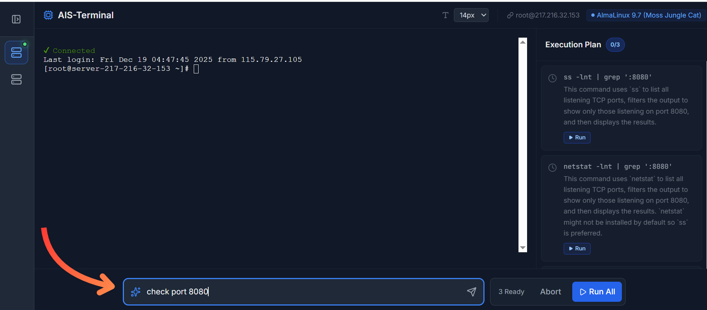

<div align="center">
    <h1>AIS-Terminal</h1>
    <p><strong>The AI-Native Terminal for Modern DevOps</strong></p>
    <p>Describe your task, get verified commands, and fix errors automatically with Gemini 2.0.</p>
</div>

<div align="center">
  
</div>

## Features

*   **Natural Language to Bash:** Just type "Check disk usage on /var" and get the correct command instantly.
*   **Auto-Fix Errors:** If a command fails, AIS-Terminal analyzes the exit code and output to suggest a fix.
*   **Full Interactive Shell:** Built on `ssh2` and `xterm.js`, supporting interactive tools like `vim`, `htop`, and `nano`.
*   **Secure:** Private keys are encrypted at rest using AES-256-GCM.
*   **Context Aware:** Automatically detects the remote Linux distribution to generate the correct package manager commands (apt, yum, dnf, pacman, etc.).

## Setup & Installation

AIS-Terminal is a local-first application consisting of a Node.js backend (for SSH connections) and a React frontend.

### Prerequisites
*   Node.js (v18+)
*   A Google Gemini API Key (Get one at [Google AI Studio](https://aistudio.google.com/))

### Steps

1.  **Clone the repository:**
    ```bash
    git clone https://github.com/your-username/ais-terminal.git
    cd ais-terminal
    ```

2.  **Install dependencies:**
    ```bash
    npm install
    ```

3.  **Configure API Key:**
    Create a `.env.local` file in the root directory and add your key:
    ```env
    GEMINI_API_KEY=your_actual_api_key_here
    ```

4.  **Start the Backend:**
    The backend handles SSH connections and encryption.
    ```bash
    node server.js
    ```
    *You should see "Server running on http://localhost:3001"*

5.  **Start the Frontend:**
    Open a new terminal window and run:
    ```bash
    npm run dev
    ```
    *The app will open at http://localhost:5173*

## Landing Page (Marketing Mode)

The application includes a built-in Landing Page for introductions or public hosting.
*   **Default View:** When running locally, the app defaults to the Landing Page. Click **"Launch App"** to enter the terminal.
*   **Static Hosting:** You can build the frontend (`npm run build`) and host the `dist/` folder on any static site provider (GitHub Pages, Netlify, Vercel). The Landing Page will work, but the "Launch App" button will strictly point to `/app`, which requires the local backend to be running to function.

## Architecture

*   **Frontend:** React, Vite, Tailwind CSS, Lucide Icons, Xterm.js
*   **Backend:** Node.js, Express, Socket.io, SSH2
*   **AI:** Google Gemini 2.0 Flash via `@google/genai`

## License
MIT
